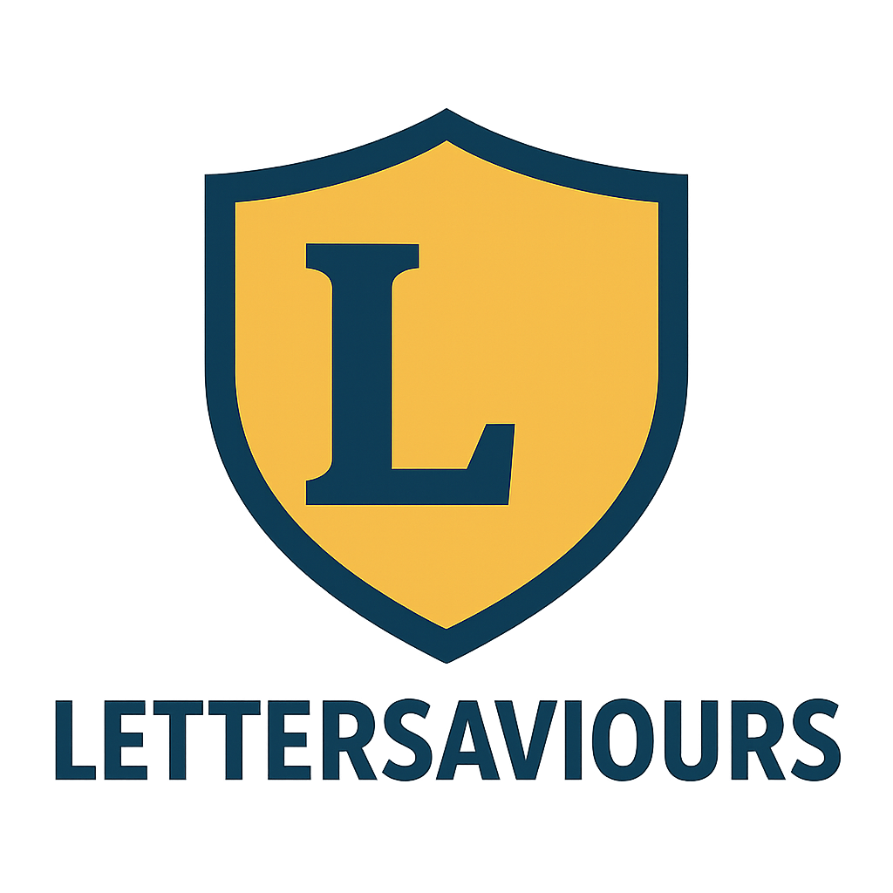

<h1 align="center"><strong>LetterSaviours</strong></h1>

  

<strong>LetterSaviours</strong> is a fun and interactive Hangman game!
Guess letters, save the word, and test your puzzle-solving skills! 🧠✨

---

## 📑 Table of Contents
- [Description](#-description)
- [Documentation](#-documentation)
- [Features](#-features)
- [Tools and Languages](#-tools-and-languages)
- [Team](#-team)

---

## 📋 Description

🎯 <strong>LetterSaviours</strong> is a Hangman game implemented in C++.  
Players try to guess a hidden word by suggesting letters before the hangman is completed.  
Challenge your mind, have fun, and improve your vocabulary! 📖💡

---

## 📖 Documentation

- 📄 **Word Documentation:** `LetterSaviours/docs/Documentation.docx`  
- 📊 **Presentation:** `LetterSaviours/docs/Presentation.pptx`  

---

## 🎮 Features

✅ Guess letters to reveal the hidden word 🔤  
✅ Hangman visual stages for each wrong attempt 👎  
✅ Limited attempts to increase challenge ⚡  
✅ Fun and educational gameplay 🎓

---

## 🛠️ Tools and Languages

<a href="https://www.microsoft.com/en-us/microsoft-365/powerpoint">

<a href="https://teams.microsoft.com/v2//">

---

## 👤 Team

<table>
  <tr align="center">
    <th><strong>Name</strong></th>
    <th><strong>Role</strong></th>
    <th><strong>Class</strong></th>
  </tr>
  <tr align="center">
    <td><strong>Bozhidar Stanev</strong></td>
    <td><strong>Scrum Trainer</strong></td>
    <td>9B</td>
  </tr>
  <tr align="center">
    <td><strong>Aleksandar Petrov</strong></td>
    <td><strong>Front-end Developer</strong></td>
    <td>9G</td>
  </tr>
  <tr align="center">
    <td><strong>Mustafa Husein</strong></td>
    <td><strong>Back-end Developer</strong></td>
    <td>9A</td>
  </tr>
  <tr align="center">
    <td><strong>Nikoleta Georgieva</strong></td>
    <td><strong>Designer</strong></td>
    <td>9B</td>
  </tr>
</table>

